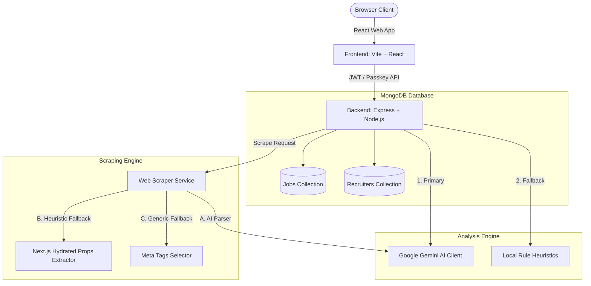

# TrustRemote Design Document

This document outlines the design and technical architecture of **TrustRemote**, an E2E remote job legitimacy verification and vetting portal.

---

## 1. System Architecture



---

## 2. Scraping Engine Architecture

The web scraping engine is designed to parse unstructured job descriptions from external URLs into structured data, ensuring resiliency when external APIs are suspended or blocked.

```
       +---------------------------------------------+
       |             HTTP Scrape Request             |
       +---------------------------------------------+
                              |
                     [Fetch HTML Content]
                              |
                    [Clean HTML Tags/CSS]
                              |
                              v
             /---------------------------------\
            /       Is Gemini API Active?       \
            \                                   /
             \---------------------------------/
                       /               \
                Yes   /                 \ No / Error
                     v                   v
        +-------------------------+     +--------------------------------+
        |   Gemini Flash Model    |     |   Local Scraper (Heuristics)   |
        |   Extracts & returns    |     +--------------------------------+
        |   JSON formatted job    |                      |
        +-------------------------+                      v
                                        /---------------------------------\
                                       /  Is nextJS / Rippling ATS page?  \
                                       \                                  /
                                        \---------------------------------/
                                                  /               \
                                           Yes   /                 \ No
                                                v                   v
                                  +-------------------+    +-------------------+
                                  | Extract metadata  |    | Parse HTML Meta   |
                                  | from NEXT_DATA    |    | Tags & clean tags |
                                  | script node props |    | in page body text |
                                  +-------------------+    +-------------------+
```

### Components
1. **Gemini Extraction**: Submits stripped body text to `gemini-1.5-flash` with a JSON-mode configuration asking for structured extraction of:
   - `title`, `company`, `location`, `salary`, `category`, `description`, `recruiterInfo`.
2. **Next.js Hydrated Props Extractor**: Parses Next.js dehydrated states (`__NEXT_DATA__`) inside the HTML. Specifically configured to capture Rippling-style JSON payloads (keys `props.pageProps.apiData.jobPost`).
3. **General Meta-Tag Parser**: Uses RegExp matching to read title elements, open-graph tags (`og:title`, `og:description`), and standard meta descriptions.

---

## 3. Legitimacy & Safety Vetting Engine

To protect remote jobseekers from financial, phishing, and data harvesting scams, TrustRemote runs incoming jobs through two safety layers:

### Primary Layer: Google Gemini AI
- Submits full text blocks and recruiter email domains to Gemini.
- Checks indicators against a list of known remote fraud types (e.g. check-cashing scams, text-only chat redirects, premium numbers, payment deposits).
- Returns a structured safety report (`trustScore`, `status`, `verdict`, and flag arrays).
- Evaluates the description and location to identify if the role is truly remote. If it mentions hybrid/onsite work constraints, it flags a **Non-Remote Role Alert**.

### Fallback Layer: Rule-Based Heuristics
If the Gemini API key is suspended or fails, the local backend executes regex checks:
- **Work Mode Heuristics**: Searches description and location text for onsite/hybrid keywords to trigger non-remote warnings.
- **Telegram / WhatsApp Redirection**: Detects redirection to insecure messaging apps for text-only interviews.
- **Check-Cashing / Equipment Deposit**: Catches classic "we ship you a check to buy a laptop" schemes.
- **Free Recruiter Domain Check**: Flags recruiter contact points using `@gmail.com`, `@yahoo.com`, or `@outlook.com` instead of company domains.
- **Compensation Discrepancies**: Checks for entry-level tasks offering inflated hourly wages (e.g. $45-$60/hr for Data Entry).

### Scoring & Status Calculation
The Heuristics Engine evaluates job listings starting from a baseline score of **100%**. Demerits are applied based on identified risk vectors, and bonuses are awarded for verified trust indicators (capped at a maximum score of **100%**):

| Vector Category | Adjustment | Description |
| :--- | :---: | :--- |
| **Check Fraud / Equipment Deposit** | `-40` | Mentions of checks mailed for purchasing office gear (laptops, printers). |
| **High-Risk Chat Redirection** | `-35` | Directing candidate to interview on anonymous messaging apps (Telegram, Signal). |
| **Email Spoofing Risk** | `-25` | Recruiter's corporate email domain does not align with the job posting website domain. |
| **High Hourly Rates for Entry-Level** | `-20` | Entry-level admin/data entry tasks offering inflated pay rates ($40-$60/hr). |
| **Moderate-Risk Chat Redirection** | `-20` | Requests to use WhatsApp for recruitment communication. |
| **Public Email Domain** | `-15` | Recruiter contact uses public domains (Gmail, Yahoo, Outlook, Hotmail). |
| **Insecure Interview Mode** | `-10` | No standard video interview platforms (Zoom, Google Meet, Teams) mentioned. |
| **Verified ATS Host (Bonus)** | `+10` | Job Description hosted on a trusted ATS domain (`rippling.com`, `greenhouse.io`, `lever.co`, `workday.com`). |
| **Trusted Portal Tracking (Bonus)** | `+10` | Job Description URL contains tracking from trusted portals (`jobSite=LinkedIn` or `utm_source=indeed`). |

#### Cross-Portal Footprint Metric
The safety engine computes and returns a `crossPortalIndex` string under the `metrics` object representing the verified sources (e.g., `"LinkedIn, Rippling ATS"` or `"None Detected"`).

#### Limits & Status Verdicts:
- **Min/Max Score**: Bounded between `10%` and `100%`.
- **Status Verdict Thresholds**:
  - **Score < 50%**: status = `Scam` (Dangerous, high risk of remote employment fraud).
  - **Score 50% - 84%**: status = `Suspicious` (Caution advised, manual verification recommended).
  - **Score >= 85%**: status = `Verified` (Lacks common remote job fraud indicators).

---

## 4. API Endpoints

### 1. `GET /api/jobs`
- **Description**: Returns all vetted remote job listings.
- **Response**: Array of job records ordered by creation date.

### 2. `POST /api/jobs`
- **Description**: Submits a new job.
- **Headers**: `Authorization: Bearer <token_or_passcode>`
- **Behavior**: Auto-vets legitimacy using the safety engine. Supports legacy passcode or JWT authentication token. If clean, saves to MongoDB and updates the live job feed.

### 3. `POST /api/scan`
- **Description**: Analyzes job posting text.
- **Request Body**: `{ description, recruiterInfo, jdUrl }`
- **Features**: Automatically scrapes and analyzes the URL if `description` is omitted.

### 4. `POST /api/scrape`
- **Description**: Fetches external job postings.
- **Request Body**: `{ url }`
- **Response**: Returns structured details (`title`, `company`, `location`, `salary`, `description`).

### 5. `POST /api/auth/register`
- **Description**: Creates a new recruiter profile. Enforces corporate email domain restriction.
- **Request Body**: `{ email, password }`
- **Response**: `{ token, email }`

### 6. `POST /api/auth/login`
- **Description**: Authenticates recruiter via password.
- **Request Body**: `{ email, password }`
- **Response**: `{ token, email, hasPasskey }`

### 7. `POST /api/auth/passkey/register-challenge`
- **Description**: Generates a challenge for the browser's credentials API.
- **Request Body**: `{ email }`
- **Response**: WebAuthn credential creation configuration.

### 8. `POST /api/auth/passkey/register-verify`
- **Description**: Validates browser-enrolled credential data and links the public key.
- **Request Body**: `{ email, credentialId, publicKey }`
- **Response**: `{ success: true }`

### 9. `POST /api/auth/passkey/login-challenge`
- **Description**: Generates an authentication challenge.
- **Request Body**: `{ email }`
- **Response**: WebAuthn request options.

### 10. `POST /api/auth/passkey/login-verify`
- **Description**: Validates the cryptographic signature against the stored public key.
- **Request Body**: `{ email, credentialId, clientDataJSON, authenticatorData, signature }`
- **Response**: `{ token, email }`

---

## 5. Security & Authorization

TrustRemote protects the integrity of job postings using a multi-factor secure recruiter system:
- **Corporate Restriction**: Only emails from verified organizational domains are allowed to sign up. Public consumer domains like `@gmail.com` or `@yahoo.com` are strictly rejected.
- **Secure Password Hashing**: Passwords are securely hashed with SHA-256 before storage.
- **Zero-Dependency JWT Authorization**: Successful password or passkey login returns a standard JWT token generated via Node's native `crypto.createHmac`. Write endpoints like `POST /api/jobs` verify this token. (Supports legacy passcode `RECRUITER_PASSCODE` for backward compatibility).
- **Passwordless Passkeys (WebAuthn)**:
  - **Registration**: Recruiters generate cryptographic credential keypairs locally (e.g. via Windows Hello or touch ID). The browser retrieves the DER public key via `getPublicKey()` and registers it on the server.
  - **Authentication**: When logging in, the server issues a unique challenge. The browser signs this challenge, and the server cryptographically validates the signature against the registered public key using `crypto.verify`. This flow is completely phishing-resistant.

---

## 6. Automation Testing

We use **Playwright** to run end-to-end integration tests. The test suite is defined in [tests/trustremote.spec.ts](file:///e:/SWB%20Hackathon%20V2/tests/trustremote.spec.ts) and covers:
1. **Positive Scenario - Feed & Inspector**: Loading job feeds and inspecting details.
2. **Positive Scenario - AI Scan**: Scanning a safe React Developer description.
3. **Positive Scenario - Scraper**: Fetching details from a Rippling ATS URL, verifying automatic form prefilling, and running scans.
4. **Positive Scenario - Recruiter Indexing**: Publishing new vetted positions from the console after corporate signup.
5. **Positive Scenario - Board Filters & Bookmarks**: Saving listings locally and validating sidebar filters (Min Trust, Saved, Remote).
6. **Negative Scenario - Fraud Catching**: Verifying that the scanner catches Telegram/check fraud and issues alert flags.
7. **Negative Scenario - Form Validation**: Preventing job submissions when required fields are missing.
8. **Negative Scenario - Non-Remote Roles**: Verifying that non-remote/hybrid jobs trigger alert warnings.

---

## 7. Layout Redesign & CSS Fixes

To accommodate widescreen layouts and prevent body overflow or squishing bugs:
1. **Relocated Filters & Category Pills**:
   - The search/status filter bar and the category navigation pills are positioned outside the two-column grid (`.board-grid`) in a full-width header block (`.filter-controls-row`) directly under the stats banner.
   - States are lifted to [App.jsx](file:///e:/SWB%20Hackathon%20V2/src/App.jsx) and passed down to children.
2. **Grid-Cell Overspill Fix**:
   - Configured `.main-list-content` with `min-height: 0;` to prevent standard CSS grid cell vertical height stretching, allowing internal flex wrappers to control scroll behavior within the viewport.
3. **Flex-Shrink Card Fix**:
   - Configured `.job-card` inside [JobCard.jsx](file:///e:/SWB%20Hackathon%20V2/src/components/JobCard.jsx) with `flex-shrink: 0;` to block browsers from squashing cards to overlapping thin rows under height-constrained flex parents.
4. **Mobile Stacking Context Overlay**:
   - Rendered the `.mobile-inspector-modal` overlay at the root of `App.jsx` to escape stacking contexts generated by container transformations, ensuring blurred backgrounds are centered correctly.
5. **Dynamic Dashboard Metrics**:
   - Refactored [StatsBanner.jsx](file:///e:/SWB%20Hackathon%20V2/src/components/StatsBanner.jsx) to compute evaluations, verified legitimacy counts, trust index averages, and scams shielded in real-time based on live database values.

