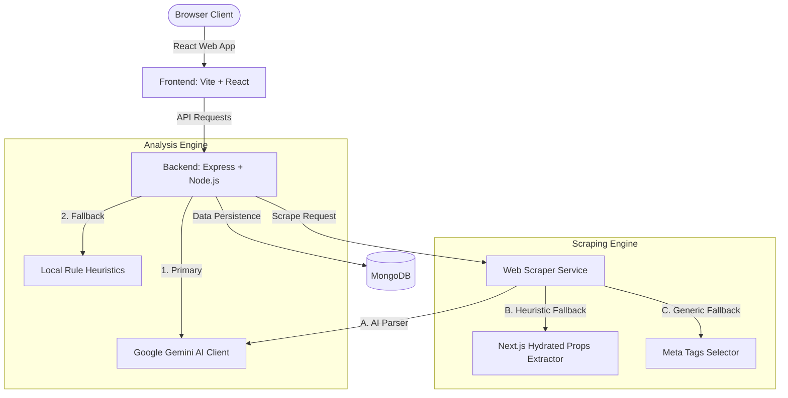

# TrustRemote Design Document

This document outlines the design and technical architecture of **TrustRemote**, an E2E remote job legitimacy verification and vetting portal.

---

## 1. System Architecture



---

## 2. Scraping Engine Architecture

The web scraping engine is designed to parse unstructured job descriptions from external URLs into structured data, ensuring resiliency when external APIs are suspended or blocked.

```
       +---------------------------------------------+
       |             HTTP Scrape Request             |
       +---------------------------------------------+
                              |
                     [Fetch HTML Content]
                              |
                    [Clean HTML Tags/CSS]
                              |
                              v
             /---------------------------------\
            /       Is Gemini API Active?       \
            \                                   /
             \---------------------------------/
                       /               \
                Yes   /                 \ No / Error
                     v                   v
        +-------------------------+     +--------------------------------+
        |   Gemini Flash Model    |     |   Local Scraper (Heuristics)   |
        |   Extracts & returns    |     +--------------------------------+
        |   JSON formatted job    |                      |
        +-------------------------+                      v
                                        /---------------------------------\
                                       /  Is nextJS / Rippling ATS page?  \
                                       \                                  /
                                        \---------------------------------/
                                                  /               \
                                           Yes   /                 \ No
                                                v                   v
                                  +-------------------+    +-------------------+
                                  | Extract metadata  |    | Parse HTML Meta   |
                                  | from NEXT_DATA    |    | Tags & clean tags |
                                  | script node props |    | in page body text |
                                  +-------------------+    +-------------------+
```

### Components
1. **Gemini Extraction**: Submits stripped body text to `gemini-1.5-flash` with a JSON-mode configuration asking for structured extraction of:
   - `title`, `company`, `location`, `salary`, `category`, `description`, `recruiterInfo`.
2. **Next.js Hydrated Props Extractor**: Parses Next.js dehydrated states (`__NEXT_DATA__`) inside the HTML. Specifically configured to capture Rippling-style JSON payloads (keys `props.pageProps.apiData.jobPost`).
3. **General Meta-Tag Parser**: Uses RegExp matching to read title elements, open-graph tags (`og:title`, `og:description`), and standard meta descriptions.

---

## 3. Legitimacy & Safety Vetting Engine

To protect remote jobseekers from financial, phishing, and data harvesting scams, TrustRemote runs incoming jobs through two safety layers:

### Primary Layer: Google Gemini AI
- Submits full text blocks and recruiter email domains to Gemini.
- Checks indicators against a list of known remote fraud types (e.g. check-cashing scams, text-only chat redirects, premium numbers, payment deposits).
- Returns a structured safety report (`trustScore`, `status`, `verdict`, and flag arrays).

### Fallback Layer: Rule-Based Heuristics
If the Gemini API key is suspended or fails, the local backend executes regex checks:
- **Telegram / WhatsApp Redirection**: Detects redirection to insecure messaging apps for text-only interviews.
- **Check-Cashing / Equipment Deposit**: Catches classic "we ship you a check to buy a laptop" schemes.
- **Free Recruiter Domain Check**: Flags standard recruiter contact points using `@gmail.com`, `@yahoo.com`, or `@outlook.com` instead of company domains.
- **Compensation Discrepancies**: Checks for entry-level tasks offering inflated hourly wages (e.g. $45-$60/hr for Data Entry).

---

## 4. API Endpoints

### 1. `GET /api/jobs`
- **Description**: Returns all vetted remote job listings.
- **Response**: Array of job records ordered by creation date.

### 2. `POST /api/jobs`
- **Description**: Submits a new job.
- **Headers**: `Authorization: Bearer <passcode>`
- **Behavior**: Auto-vets legitimacy using the safety engine. If clean, saves to MongoDB and updates the live job feed.

### 3. `POST /api/scan`
- **Description**: Analyzes job posting text.
- **Request Body**: `{ description, recruiterInfo, jdUrl }`
- **Features**: Automatically scrapes and analyzes the URL if `description` is omitted.

### 4. `POST /api/scrape`
- **Description**: Fetches external job postings.
- **Request Body**: `{ url }`
- **Response**: Returns structured details (`title`, `company`, `location`, `salary`, `description`).

---

## 5. Security & Authorization

The Recruiter Console is secured behind a passcode authorization scheme:
- **Passcode Variable**: Configured via `RECRUITER_PASSCODE` in environment variables.
- **Session Locking**: Stored client-side inside `localStorage`.
- **Backend Checks**: All write endpoints require matching token headers.

---

## 6. Automation Testing

We use **Playwright** to run end-to-end integration tests. The test suite is defined in [tests/trustremote.spec.ts](file:///e:/SWB%20Hackathon%20V2/tests/trustremote.spec.ts) and covers:
1. **Positive Scenario - Feed & Inspector**: Loading job feeds and inspecting details.
2. **Positive Scenario - AI Scan**: Scanning a safe React Developer description.
3. **Positive Scenario - Scraper**: Fetching details from a Rippling ATS URL, verifying automatic form prefilling, and running scans.
4. **Positive Scenario - Recruiter Indexing**: Publishing new vetted positions from the console.
5. **Negative Scenario - Fraud Catching**: Verifying that the scanner catches Telegram/check fraud and issues alert flags.
6. **Negative Scenario - Form Validation**: Preventing job submissions when required fields are missing.
